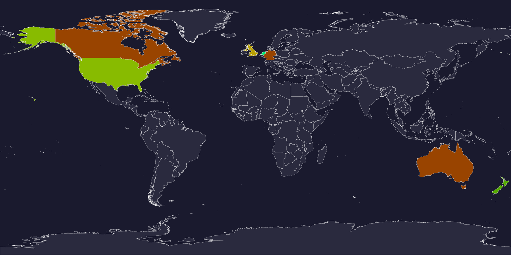

# Email Security World Requirements

> A community-maintained reference documenting which countries require or recommend
> SPF, DKIM, DMARC, STARTTLS, DANE, DNSSEC, MTA-STS, TLS-RPT, CAA, and BIMI
> at government or national policy level.

[](https://github.com/thorsheim/email-security-world-requirements/actions/workflows/validate.yml)
[](data/countries/)

**Live interactive map:** [thorsheim.github.io/email-security-world-requirements](https://thorsheim.github.io/email-security-world-requirements/)  
**Web version:** [passwordscon.org/mailrequirements/](https://passwordscon.org/mailrequirements/)

---

## Why this exists

Phishing, spam, and email impersonation remain among the most effective attack vectors globally.
A growing number of governments have responded by mandating or formally recommending technical
email security standards for public sector organisations and critical infrastructure.

This project answers a simple question: **who requires what, and under which policy?**

The data is stored as machine-readable YAML, validated against a JSON Schema, and rendered as
an interactive world map and sortable requirements matrix. All sources are cited; contributions
via Pull Request are welcome.

---

## World Map

[](https://thorsheim.github.io/email-security-world-requirements/)

*Green = more mandatory standards · Red = no requirements · Grey = no data yet*  
*[Open interactive version →](https://thorsheim.github.io/email-security-world-requirements/)*

---

## Requirements Matrix

<!-- BEGIN_MATRIX -->

| Country | Authority | [SPF](docs/standards/spf.md) | [DKIM](docs/standards/dkim.md) | [DMARC](docs/standards/dmarc.md) | [STARTTLS](docs/standards/starttls.md) | [DANE](docs/standards/dane.md) | [DNSSEC](docs/standards/dnssec.md) | [MTA-STS](docs/standards/mta-sts.md) | [TLS-RPT](docs/standards/tls-rpt.md) | [CAA](docs/standards/caa.md) | [RPKI](docs/standards/rpki.md) | [ASPA](docs/standards/aspa.md) | [BIMI](docs/standards/bimi.md) | Applies To |
| :--- | :--- | :---: | :---: | :---: | :---: | :---: | :---: | :---: | :---: | :---: | :---: | :---: | :---: | :--- |
| 🇦🇺 Australia | [ASD / ACSC](https://www.cyber.gov.au/resources-business-and-government/maintaining-devices-and-systems/system-hardening-and-administration/email-hardening/how-combat-fake-emails) | 🔶 R | 🔶 R | 🔶 R | 🔶 R | ℹ️ | 🔶 R | ℹ️ | ℹ️ | 🔶 R | ℹ️ | ❓ | ℹ️ | Government Agencies |
| 🇨🇦 Canada | [CCCS / Treasury Board](https://www.canada.ca/en/government/system/digital-government/policies-standards/enterprise-it-service-common-configurations/email.html) · [CCCS](https://www.cyber.gc.ca/en/guidance/email-security) | 🔶 R | 🔶 R | 🔶 R | 🔶 R | ℹ️ | 🔶 R | ℹ️ | ℹ️ | ℹ️ | ℹ️ | ❓ | ℹ️ | Government Agencies |
| 🇩🇪 Germany | [BSI](https://www.bsi.bund.de/DE/Themen/Unternehmen-und-Organisationen/Standards-und-Zertifizierung/Technische-Richtlinien/TR-nach-Thema-sortiert/tr03108/TR-03108_node.html) | 🔶 R | 🔶 R | 🔶 R | 🔶 R | ℹ️ | 🔶 R | ℹ️ | ℹ️ | 🔶 R | ℹ️ | ❓ | ℹ️ | Critical Infrastructure, Government Agencies |
| 🇪🇺 European Union | [ENISA / NIS2](https://www.enisa.europa.eu/topics/cybersecurity-policy/nis-directive-new) | ℹ️ | ℹ️ | ℹ️ | ℹ️ | ℹ️ | ℹ️ | ℹ️ | ℹ️ | ℹ️ | ℹ️ | ❓ | ℹ️ | Critical Infrastructure |
| 🇫🇷 France | [ANSSI](https://www.ssi.gouv.fr/guide/recommandations-pour-la-securisation-des-courriels/) | 🔶 R | 🔶 R | 🔶 R | 🔶 R | ℹ️ | 🔶 R | ℹ️ | ℹ️ | ℹ️ | ℹ️ | ❓ | ℹ️ | Critical Infrastructure, Government Agencies |
| 🇬🇧 United Kingdom | [NCSC](https://www.ncsc.gov.uk/collection/email-security-and-anti-spoofing) | ✅ M | ✅ M | ✅ M (reject) | ✅ M | ℹ️ | 🔶 R | 🔶 R | 🔶 R | 🔶 R | ℹ️ | ❓ | ℹ️ | Government Agencies |
| 🇳🇱 Netherlands | [Forum Standaardisatie / NCSA](https://www.forumstandaardisatie.nl/open-standaarden/verplicht) · [NCSC](https://www.ncsc.nl/onderwerpen/e-mailbeveiliging) | ✅ M | ✅ M | ✅ M (reject) | ✅ M | ✅ M | ✅ M | 🔶 R | ✅ M | ✅ M | 🔶 R | ℹ️ | ℹ️ | Government Agencies |
| 🇺🇸 United States | [CISA](https://www.cisa.gov/resources-tools/resources/email-security-best-practices) · [ONCD](https://www.whitehouse.gov/oncd/) | ✅ M | 🔶 R | ✅ M (reject) | ✅ M | ℹ️ | ✅ M | 🔶 R | 🔶 R | 🔶 R | 🔶 R | ℹ️ | ℹ️ | Federal Agencies, Private Sector |

### Legend

**Status icons**

| Icon | Status | Meaning |
| :---: | :--- | :--- |
| ✅ M | **Mandatory** | Legally or policy-required; non-compliance has consequences |
| 🔶 R | **Recommended** | Official guidance or best-practice document published by a government body |
| ℹ️ | **Informational** | Mentioned in an official document but no clear directive |
| ➖ | **None** | Explicitly confirmed as not required |
| ❓ | **Unknown** | No official data found |

**Standards grouping**

| Group | Standards | Purpose |
| :--- | :--- | :--- |
| Sender authentication | SPF · DKIM · DMARC | Verify who sent the message |
| Transport security | STARTTLS · DANE · DNSSEC · MTA-STS · TLS-RPT | Encrypt and secure delivery |
| Infrastructure | CAA | Restrict certificate issuance |
| Routing security | RPKI · ASPA | Protect against BGP hijacking and route leaks |
| Emerging | BIMI | Visual brand verification |

> DANE requires DNSSEC — if a country mandates DANE, DNSSEC is implicitly required too. ASPA extends RPKI ROA and is still in IETF standardization as of 2026.

<!-- END_MATRIX -->

---

## Policy Details

Mandatory and recommended entries per country, authority, and standard — with policy document names, descriptions, and direct links to source documents.

<!-- BEGIN_DETAILS -->

| Country | Authority | Standard | Status | Policy Document | Description | Source |
| :--- | :--- | :--- | :---: | :--- | :--- | :--- |
| 🇦🇺 Australia | [ASD / ACSC](https://www.cyber.gov.au/resources-business-and-government/maintaining-devices-and-systems/system-hardening-and-administration/email-hardening/how-combat-fake-emails) | [SPF](docs/standards/spf.md) | 🔶 R | ISM |  | [ACSC - How to combat fake emails](https://www.cyber.gov.au/resources-business-and-government/maintaining-devices-and-systems/system-hardening-and-administration/email-hardening/how-combat-fake-emails) |
|  | [ASD / ACSC](https://www.cyber.gov.au/resources-business-and-government/maintaining-devices-and-systems/system-hardening-and-administration/email-hardening/how-combat-fake-emails) | [DKIM](docs/standards/dkim.md) | 🔶 R | ISM |  | [ACSC - How to combat fake emails](https://www.cyber.gov.au/resources-business-and-government/maintaining-devices-and-systems/system-hardening-and-administration/email-hardening/how-combat-fake-emails) |
|  | [ASD / ACSC](https://www.cyber.gov.au/resources-business-and-government/maintaining-devices-and-systems/system-hardening-and-administration/email-hardening/how-combat-fake-emails) | [DMARC](docs/standards/dmarc.md) | 🔶 R | ISM | ISM recommends DMARC with p=reject for all Commonwealth entities. Not a binding mandate but strongly recommended through the ISM framework. | [ACSC - How to combat fake emails](https://www.cyber.gov.au/resources-business-and-government/maintaining-devices-and-systems/system-hardening-and-administration/email-hardening/how-combat-fake-emails) |
|  | [ASD / ACSC](https://www.cyber.gov.au/resources-business-and-government/maintaining-devices-and-systems/system-hardening-and-administration/email-hardening/how-combat-fake-emails) | [STARTTLS](docs/standards/starttls.md) | 🔶 R | ISM |  | [ISM - Email security controls](https://www.cyber.gov.au/resources-business-and-government/essential-cyber-security/ism) |
|  | [ASD / ACSC](https://www.cyber.gov.au/resources-business-and-government/maintaining-devices-and-systems/system-hardening-and-administration/email-hardening/how-combat-fake-emails) | [DNSSEC](docs/standards/dnssec.md) | 🔶 R | ISM | The ISM recommends DNSSEC for government domains as part of DNS hardening. | [ISM - Australian Government Information Security Manual](https://www.cyber.gov.au/resources-business-and-government/essential-cyber-security/ism) |
|  | [ASD / ACSC](https://www.cyber.gov.au/resources-business-and-government/maintaining-devices-and-systems/system-hardening-and-administration/email-hardening/how-combat-fake-emails) | [CAA](docs/standards/caa.md) | 🔶 R | ISM | CAA records recommended in ISM guidance to restrict certificate issuance. | [ISM - Australian Government Information Security Manual](https://www.cyber.gov.au/resources-business-and-government/essential-cyber-security/ism) |
| 🇨🇦 Canada | [CCCS / Treasury Board](https://www.canada.ca/en/government/system/digital-government/policies-standards/enterprise-it-service-common-configurations/email.html) | [SPF](docs/standards/spf.md) | 🔶 R | Government of Canada Email Security |  | [CCCS - Email security](https://www.cyber.gc.ca/en/guidance/email-security) |
|  | [CCCS / Treasury Board](https://www.canada.ca/en/government/system/digital-government/policies-standards/enterprise-it-service-common-configurations/email.html) | [DKIM](docs/standards/dkim.md) | 🔶 R | Government of Canada Email Security |  | [CCCS - Email security](https://www.cyber.gc.ca/en/guidance/email-security) |
|  | [CCCS / Treasury Board](https://www.canada.ca/en/government/system/digital-government/policies-standards/enterprise-it-service-common-configurations/email.html) | [DMARC](docs/standards/dmarc.md) | 🔶 R | Government of Canada Email Security | CCCS recommends DMARC and progression toward p=reject. Not a binding directive as of 2026, but increasingly referenced in GC security… | [CCCS - Email security](https://www.cyber.gc.ca/en/guidance/email-security) |
|  | [CCCS](https://www.cyber.gc.ca/en/guidance/email-security) | [STARTTLS](docs/standards/starttls.md) | 🔶 R |  |  | [CCCS - Email security](https://www.cyber.gc.ca/en/guidance/email-security) |
|  | [CCCS](https://www.cyber.gc.ca/en/guidance/email-security) | [DNSSEC](docs/standards/dnssec.md) | 🔶 R |  | CCCS recommends DNSSEC for government domains as part of DNS infrastructure security. | [CCCS - Email security](https://www.cyber.gc.ca/en/guidance/email-security) |
| 🇩🇪 Germany | [BSI](https://www.bsi.bund.de/DE/Themen/Unternehmen-und-Organisationen/Standards-und-Zertifizierung/Technische-Richtlinien/TR-nach-Thema-sortiert/tr03108/TR-03108_node.html) | [SPF](docs/standards/spf.md) | 🔶 R | BSI TR-03108 |  | [BSI TR-03108 - Sicherer E-Mail-Transport](https://www.bsi.bund.de/DE/Themen/Unternehmen-und-Organisationen/Standards-und-Zertifizierung/Technische-Richtlinien/TR-nach-Thema-sortiert/tr03108/TR-03108_node.html) |
|  | [BSI](https://www.bsi.bund.de/DE/Themen/Unternehmen-und-Organisationen/Standards-und-Zertifizierung/Technische-Richtlinien/TR-nach-Thema-sortiert/tr03108/TR-03108_node.html) | [DKIM](docs/standards/dkim.md) | 🔶 R | BSI TR-03108 |  | [BSI TR-03108 - Sicherer E-Mail-Transport](https://www.bsi.bund.de/DE/Themen/Unternehmen-und-Organisationen/Standards-und-Zertifizierung/Technische-Richtlinien/TR-nach-Thema-sortiert/tr03108/TR-03108_node.html) |
|  | [BSI](https://www.bsi.bund.de/DE/Themen/Unternehmen-und-Organisationen/Standards-und-Zertifizierung/Technische-Richtlinien/TR-nach-Thema-sortiert/tr03108/TR-03108_node.html) | [DMARC](docs/standards/dmarc.md) | 🔶 R | BSI TR-03108 |  | [BSI TR-03108 - Sicherer E-Mail-Transport](https://www.bsi.bund.de/DE/Themen/Unternehmen-und-Organisationen/Standards-und-Zertifizierung/Technische-Richtlinien/TR-nach-Thema-sortiert/tr03108/TR-03108_node.html) |
|  | [BSI](https://www.bsi.bund.de/DE/Themen/Unternehmen-und-Organisationen/Standards-und-Zertifizierung/Technische-Richtlinien/TR-nach-Thema-sortiert/tr03108/TR-03108_node.html) | [STARTTLS](docs/standards/starttls.md) | 🔶 R | BSI TR-03108 | BSI TR-03108 requires TLS-encrypted transport. STARTTLS with strong cipher suites is mandated for email service providers qualifying under… | [BSI TR-03108 - Sicherer E-Mail-Transport](https://www.bsi.bund.de/DE/Themen/Unternehmen-und-Organisationen/Standards-und-Zertifizierung/Technische-Richtlinien/TR-nach-Thema-sortiert/tr03108/TR-03108_node.html) |
|  | [BSI](https://www.bsi.bund.de/DE/Themen/Unternehmen-und-Organisationen/Standards-und-Zertifizierung/Technische-Richtlinien/TR-nach-Thema-sortiert/tr03108/TR-03108_node.html) | [DNSSEC](docs/standards/dnssec.md) | 🔶 R | BSI TR-03108 | BSI recommends DNSSEC for government and critical infrastructure domains. Required as a prerequisite for DANE deployment. | [BSI TR-03108 - Sicherer E-Mail-Transport](https://www.bsi.bund.de/DE/Themen/Unternehmen-und-Organisationen/Standards-und-Zertifizierung/Technische-Richtlinien/TR-nach-Thema-sortiert/tr03108/TR-03108_node.html) |
|  | [BSI](https://www.bsi.bund.de/DE/Themen/Unternehmen-und-Organisationen/Standards-und-Zertifizierung/Technische-Richtlinien/TR-nach-Thema-sortiert/tr03108/TR-03108_node.html) | [CAA](docs/standards/caa.md) | 🔶 R |  | BSI recommends CAA records as part of domain security hardening. | [BSI TR-03108 - Sicherer E-Mail-Transport](https://www.bsi.bund.de/DE/Themen/Unternehmen-und-Organisationen/Standards-und-Zertifizierung/Technische-Richtlinien/TR-nach-Thema-sortiert/tr03108/TR-03108_node.html) |
| 🇫🇷 France | [ANSSI](https://www.ssi.gouv.fr/guide/recommandations-pour-la-securisation-des-courriels/) | [SPF](docs/standards/spf.md) | 🔶 R | Recommandations pour la sécurisation des courriels |  | [ANSSI - Recommandations pour la sécurisation des courriels](https://www.ssi.gouv.fr/guide/recommandations-pour-la-securisation-des-courriels/) |
|  | [ANSSI](https://www.ssi.gouv.fr/guide/recommandations-pour-la-securisation-des-courriels/) | [DKIM](docs/standards/dkim.md) | 🔶 R | Recommandations pour la sécurisation des courriels |  | [ANSSI - Recommandations pour la sécurisation des courriels](https://www.ssi.gouv.fr/guide/recommandations-pour-la-securisation-des-courriels/) |
|  | [ANSSI](https://www.ssi.gouv.fr/guide/recommandations-pour-la-securisation-des-courriels/) | [DMARC](docs/standards/dmarc.md) | 🔶 R | Recommandations pour la sécurisation des courriels |  | [ANSSI - Recommandations pour la sécurisation des courriels](https://www.ssi.gouv.fr/guide/recommandations-pour-la-securisation-des-courriels/) |
|  | [ANSSI](https://www.ssi.gouv.fr/guide/recommandations-pour-la-securisation-des-courriels/) | [STARTTLS](docs/standards/starttls.md) | 🔶 R |  |  | [ANSSI - Recommandations pour la sécurisation des courriels](https://www.ssi.gouv.fr/guide/recommandations-pour-la-securisation-des-courriels/) |
|  | [ANSSI](https://www.ssi.gouv.fr/guide/recommandations-pour-la-securisation-des-courriels/) | [DNSSEC](docs/standards/dnssec.md) | 🔶 R |  | ANSSI recommends DNSSEC as part of general DNS security guidance. | [ANSSI - Recommandations pour la sécurisation des noms de domaine](https://www.ssi.gouv.fr/guide/recommandations-pour-la-securisation-des-noms-de-domaine/) |
| 🇬🇧 United Kingdom | [NCSC](https://www.ncsc.gov.uk/collection/email-security-and-anti-spoofing) | [SPF](docs/standards/spf.md) | ✅ M | Email security and anti-spoofing guidance |  | [NCSC - Anti-spoofing: SPF](https://www.ncsc.gov.uk/collection/email-security-and-anti-spoofing/anti-spoofing-using-spf) |
|  | [NCSC](https://www.ncsc.gov.uk/collection/email-security-and-anti-spoofing) | [DKIM](docs/standards/dkim.md) | ✅ M | Email security and anti-spoofing guidance |  | [NCSC - Anti-spoofing: DKIM](https://www.ncsc.gov.uk/collection/email-security-and-anti-spoofing/anti-spoofing-using-dkim) |
|  | [NCSC](https://www.ncsc.gov.uk/collection/email-security-and-anti-spoofing) | [DMARC](docs/standards/dmarc.md) | ✅ M (reject) | Email security and anti-spoofing guidance | NCSC requires DMARC for all .gov.uk and public sector domains. p=reject is the target; p=none is only acceptable as a monitoring phase. | [NCSC - Anti-spoofing: DMARC](https://www.ncsc.gov.uk/collection/email-security-and-anti-spoofing/anti-spoofing-using-dmarc) |
|  | [NCSC](https://www.ncsc.gov.uk/collection/email-security-and-anti-spoofing) | [STARTTLS](docs/standards/starttls.md) | ✅ M | Email security and anti-spoofing guidance |  | [NCSC - Securing email in transit](https://www.ncsc.gov.uk/collection/email-security-and-anti-spoofing/securing-email-in-transit) |
|  | [NCSC](https://www.ncsc.gov.uk/collection/email-security-and-anti-spoofing) | [MTA-STS](docs/standards/mta-sts.md) | 🔶 R |  | Recommended by NCSC Mail Check as a best practice for .gov.uk domains. | [NCSC Mail Check - MTA-STS](https://www.ncsc.gov.uk/information/mail-check) |
|  | [NCSC](https://www.ncsc.gov.uk/collection/email-security-and-anti-spoofing) | [TLS-RPT](docs/standards/tls-rpt.md) | 🔶 R |  | Recommended alongside MTA-STS in NCSC Mail Check guidance. | [NCSC Mail Check Service](https://www.ncsc.gov.uk/information/mail-check) |
|  | [NCSC](https://www.ncsc.gov.uk/collection/email-security-and-anti-spoofing) | [DNSSEC](docs/standards/dnssec.md) | 🔶 R |  | NCSC guidance recommends DNSSEC for government domains. Required for DANE deployment. Adoption across UK government domains varies; NCSC… | [NCSC - Protecting domains that don't send email](https://www.ncsc.gov.uk/collection/email-security-and-anti-spoofing) |
|  | [NCSC](https://www.ncsc.gov.uk/collection/email-security-and-anti-spoofing) | [CAA](docs/standards/caa.md) | 🔶 R |  | NCSC recommends CAA records as part of domain security guidance to restrict certificate issuance to authorized CAs. | [NCSC Mail Check Service](https://www.ncsc.gov.uk/information/mail-check) |
| 🇳🇱 Netherlands | [Forum Standaardisatie / NCSA](https://www.forumstandaardisatie.nl/open-standaarden/verplicht) | [SPF](docs/standards/spf.md) | ✅ M | Pas-toe-of-leg-uit lijst |  | [SPF - Forum Standaardisatie](https://www.forumstandaardisatie.nl/open-standaarden/spf) |
|  | [Forum Standaardisatie / NCSA](https://www.forumstandaardisatie.nl/open-standaarden/verplicht) | [DKIM](docs/standards/dkim.md) | ✅ M | Pas-toe-of-leg-uit lijst |  | [DKIM - Forum Standaardisatie](https://www.forumstandaardisatie.nl/open-standaarden/dkim) |
|  | [Forum Standaardisatie / NCSA](https://www.forumstandaardisatie.nl/open-standaarden/verplicht) | [DMARC](docs/standards/dmarc.md) | ✅ M (reject) | Pas-toe-of-leg-uit lijst | p=reject is the target policy. p=quarantine is accepted as a transition state but p=reject is required for full compliance. | [DMARC - Forum Standaardisatie](https://www.forumstandaardisatie.nl/open-standaarden/dmarc) |
|  | [Forum Standaardisatie / NCSA](https://www.forumstandaardisatie.nl/open-standaarden/verplicht) | [DANE](docs/standards/dane.md) | ✅ M | Pas-toe-of-leg-uit lijst | DANE/TLSA required for both inbound (MX) and outbound SMTP. DNSSEC must be enabled on the domain for DANE to function. | [DANE - Forum Standaardisatie](https://www.forumstandaardisatie.nl/open-standaarden/dane) |
|  | [Forum Standaardisatie / NCSA](https://www.forumstandaardisatie.nl/open-standaarden/verplicht) | [STARTTLS](docs/standards/starttls.md) | ✅ M | Pas-toe-of-leg-uit lijst |  | [STARTTLS - Forum Standaardisatie](https://www.forumstandaardisatie.nl/open-standaarden/starttls-dane) |
|  | [Forum Standaardisatie / NCSA](https://www.forumstandaardisatie.nl/open-standaarden/verplicht) | [TLS-RPT](docs/standards/tls-rpt.md) | ✅ M | Pas-toe-of-leg-uit lijst |  | [SMTP MTA-STS and TLS-RPT - Forum Standaardisatie](https://www.forumstandaardisatie.nl/open-standaarden/smtp-mta-sts) |
|  | [NCSC](https://www.ncsc.nl/onderwerpen/e-mailbeveiliging) | [MTA-STS](docs/standards/mta-sts.md) | 🔶 R |  | Recommended as complementary to DANE for domains that cannot immediately deploy DNSSEC. Not on the mandatory list as of 2024. | [NCSC - Adviezen e-mailbeveiliging](https://www.ncsc.nl/onderwerpen/e-mailbeveiliging) |
|  | [Forum Standaardisatie / NCSA](https://www.forumstandaardisatie.nl/open-standaarden/verplicht) | [DNSSEC](docs/standards/dnssec.md) | ✅ M | Pas-toe-of-leg-uit lijst | DNSSEC is required for all government domains and is a prerequisite for DANE, which is also mandatory. Both inbound and outbound mail… | [DNSSEC - Forum Standaardisatie](https://www.forumstandaardisatie.nl/open-standaarden/dnssec) |
|  | [Forum Standaardisatie / NCSA](https://www.forumstandaardisatie.nl/open-standaarden/verplicht) | [CAA](docs/standards/caa.md) | ✅ M | Pas-toe-of-leg-uit lijst | CAA records are required for all government domains to restrict certificate issuance to authorized Certificate Authorities only. | [CAA - Forum Standaardisatie](https://www.forumstandaardisatie.nl/open-standaarden/caa) |
|  | [NCSC](https://www.ncsc.nl/onderwerpen/e-mailbeveiliging) | [RPKI](docs/standards/rpki.md) | 🔶 R |  | The NCSC and Forum Standaardisatie have published guidance on routing security including RPKI ROA. Not yet on the mandatory… | [NCSC - Beveilig je netwerk met RPKI](https://www.ncsc.nl/onderwerpen/routebeveiliging) |
| 🇺🇸 United States | [CISA](https://www.cisa.gov/resources-tools/resources/email-security-best-practices) | [SPF](docs/standards/spf.md) | ✅ M | BOD 18-01 |  | [BOD 18-01 - Technical Implementation](https://cyber.dhs.gov/bod/18-01/) |
|  | [CISA](https://www.cisa.gov/resources-tools/resources/email-security-best-practices) | [DKIM](docs/standards/dkim.md) | 🔶 R | BOD 18-01 | DKIM is strongly recommended in BOD 18-01 guidance but SPF + DMARC is the minimum mandatory baseline. CISA guidance has increasingly… | [BOD 18-01 - Technical Implementation](https://cyber.dhs.gov/bod/18-01/) |
|  | [CISA](https://www.cisa.gov/resources-tools/resources/email-security-best-practices) | [DMARC](docs/standards/dmarc.md) | ✅ M (reject) | BOD 18-01 | p=reject was required within one year of the BOD issuance (by October 2018) for all .gov sending domains. Applies to all FCEB agencies. | [BOD 18-01 - Enhance Email and Web Security](https://cyber.dhs.gov/bod/18-01/) |
|  | [CISA](https://www.cisa.gov/resources-tools/resources/email-security-best-practices) | [STARTTLS](docs/standards/starttls.md) | ✅ M | BOD 18-01 |  | [BOD 18-01 - Enhance Email and Web Security](https://cyber.dhs.gov/bod/18-01/) |
|  | [CISA](https://www.cisa.gov/resources-tools/resources/email-security-best-practices) | [MTA-STS](docs/standards/mta-sts.md) | 🔶 R |  | Recommended in CISA email security best practices as a complement to STARTTLS. Not a BOD requirement. | [CISA Email Security Best Practices](https://www.cisa.gov/resources-tools/resources/email-security-best-practices) |
|  | [CISA](https://www.cisa.gov/resources-tools/resources/email-security-best-practices) | [TLS-RPT](docs/standards/tls-rpt.md) | 🔶 R |  | Recommended alongside MTA-STS. Provides visibility into TLS failures but not a mandated requirement. | [CISA Email Security Best Practices](https://www.cisa.gov/resources-tools/resources/email-security-best-practices) |
|  | [CISA](https://www.cisa.gov/resources-tools/resources/email-security-best-practices) | [DNSSEC](docs/standards/dnssec.md) | ✅ M | BOD 18-01 | BOD 18-01 requires DNSSEC for all .gov second-level domains. This predates the email-specific requirements and covers all federal civilian… | [BOD 18-01 - Enhance Email and Web Security](https://cyber.dhs.gov/bod/18-01/) |
|  | [CISA](https://www.cisa.gov/resources-tools/resources/email-security-best-practices) | [CAA](docs/standards/caa.md) | 🔶 R |  | CISA recommends CAA records as part of general domain security best practices. Not a BOD-level mandate but referenced in CISA guidance on… | [CISA Email Security Best Practices](https://www.cisa.gov/resources-tools/resources/email-security-best-practices) |
|  | [ONCD](https://www.whitehouse.gov/oncd/) | [RPKI](docs/standards/rpki.md) | 🔶 R | Roadmap to Enhancing Internet Routing Security | The White House Office of the National Cyber Director (ONCD) published a "Roadmap to Enhancing Internet Routing Security" in March 2024. It… | [Roadmap to Enhancing Internet Routing Security — ONCD (March 2024)](https://www.whitehouse.gov/wp-content/uploads/2024/03/Roadmap-to-Enhancing-Internet-Routing-Security.pdf) |
|  | [ONCD](https://www.whitehouse.gov/oncd/) | [DNSSEC](docs/standards/dnssec.md) | 🔶 R | Roadmap to Enhancing Internet Routing Security | The ONCD roadmap calls out DNSSEC as critical infrastructure-level protection needed to secure the DNS lookups that underpin email routing,… | [Roadmap to Enhancing Internet Routing Security — ONCD (March 2024)](https://www.whitehouse.gov/wp-content/uploads/2024/03/Roadmap-to-Enhancing-Internet-Routing-Security.pdf) |

<!-- END_DETAILS -->

---

## Standards Covered (12)

| Standard | Full Name | RFC / Spec | Purpose |
|---|---|---|---|
| [SPF](docs/standards/spf.md) | Sender Policy Framework | [RFC 7208](https://datatracker.ietf.org/doc/html/rfc7208) | Authorize which servers may send mail for a domain |
| [DKIM](docs/standards/dkim.md) | DomainKeys Identified Mail | [RFC 6376](https://datatracker.ietf.org/doc/html/rfc6376) | Cryptographic signature on outgoing mail |
| [DMARC](docs/standards/dmarc.md) | Domain-based Message Authentication, Reporting and Conformance | [RFC 7489](https://datatracker.ietf.org/doc/html/rfc7489) | Policy enforcement and reporting for SPF/DKIM |
| [STARTTLS](docs/standards/starttls.md) | SMTP STARTTLS | [RFC 3207](https://datatracker.ietf.org/doc/html/rfc3207) | Encrypted mail transport baseline |
| [DANE](docs/standards/dane.md) | DNS-based Authentication of Named Entities | [RFC 6698](https://datatracker.ietf.org/doc/html/rfc6698) | Bind TLS certificates to DNS via DNSSEC |
| [DNSSEC](docs/standards/dnssec.md) | DNS Security Extensions | [RFC 4033–4035](https://datatracker.ietf.org/doc/html/rfc4033) | Cryptographically sign DNS responses; required for DANE |
| [MTA-STS](docs/standards/mta-sts.md) | Mail Transfer Agent Strict Transport Security | [RFC 8461](https://datatracker.ietf.org/doc/html/rfc8461) | Enforce TLS on delivery without requiring DNSSEC |
| [TLS-RPT](docs/standards/tls-rpt.md) | SMTP TLS Reporting | [RFC 8460](https://datatracker.ietf.org/doc/html/rfc8460) | Aggregate reports on TLS connection failures |
| [CAA](docs/standards/caa.md) | Certification Authority Authorization | [RFC 8659](https://datatracker.ietf.org/doc/html/rfc8659) | Restrict which CAs may issue certificates for a domain |
| [RPKI](docs/standards/rpki.md) | Resource Public Key Infrastructure | [RFC 6480](https://datatracker.ietf.org/doc/html/rfc6480) / [RFC 9582](https://datatracker.ietf.org/doc/html/rfc9582) | Prevent BGP hijacking via cryptographic route origin validation |
| [ASPA](docs/standards/aspa.md) | Autonomous System Provider Authorization | [IETF SIDROPS draft](https://datatracker.ietf.org/doc/draft-ietf-sidrops-aspa-profile/) | Extend RPKI to detect route leaks via provider relationship validation |
| [BIMI](docs/standards/bimi.md) | Brand Indicators for Message Identification | [BIMI Group](https://bimigroup.org) | Display a verified brand logo in supporting mail clients |

---

## Testing Tools

Test your own domain against these standards:

| Tool | URL | What it tests |
|---|---|---|
| **internet.nl** | https://internet.nl | SPF, DKIM, DMARC, DANE, DNSSEC, STARTTLS, TLS-RPT, MTA-STS — full suite; operated by the Dutch government |
| **Mailcheck** | https://passwordscon.org/mailcheck/ | SPF, DKIM, DMARC, STARTTLS, headers — quick combined tester |
| **MXToolbox** | https://mxtoolbox.com | Individual lookups for all standards |
| **dmarcian** | https://dmarcian.com | DMARC management, reporting, and SPF/DKIM analysis |
| **Hardenize** | https://www.hardenize.com | Comprehensive posture including MTA-STS and CAA |
| **DNSViz** | https://dnsviz.net | Visual DNSSEC chain analysis |
| **Verisign DNSSEC Analyzer** | https://dnssec-analyzer.verisignlabs.com | DNSSEC validation |
| **SSLMate CAA Generator** | https://sslmate.com/caa/ | Generate and validate CAA records |

---

## Contributing

Found a country that's missing? Have newer policy information? **Contributions are very welcome.**

See [CONTRIBUTING.md](CONTRIBUTING.md) for full instructions. Quick start:

1. Copy [`data/countries/_template.yaml`](data/countries/_template.yaml) to `data/countries/XX.yaml`  
   (where `XX` is the ISO 3166-1 alpha-2 country code)
2. Fill in the fields — refer to an existing file like [NL.yaml](data/countries/NL.yaml) for examples
3. Every `mandatory` or `recommended` entry needs at least one source URL in `references`  
   pointing to an official government or agency document
4. Run `python scripts/validate_data.py` — all files must pass before opening a PR
5. Open a Pull Request using the [PR template](.github/PULL_REQUEST_TEMPLATE.md)

**Unknown data is also valuable.** If you researched a country and found nothing, create the file
with `status: unknown` for all standards and note what you searched. This tells others not to
duplicate the effort.

---

## Data Format

Country data lives in [`data/countries/`](data/countries/) — one YAML file per country, validated
against [`data/schema/country.schema.json`](data/schema/country.schema.json).

Each file records, per standard:

| Field | Example values |
|---|---|
| `status` | `mandatory` · `recommended` · `informational` · `none` · `unknown` |
| `applies_to` | `government_agencies` · `federal_agencies` · `critical_infrastructure` · `all_organizations` · … |
| `authority` | `"CISA"`, `"NCSC"`, `"Forum Standaardisatie / NCSA"` |
| `policy_document` | `"BOD 18-01"`, `"BIO"`, `"BSI TR-03108"` |
| `effective_date` | `"2018-10-16"` |
| `references` | List of `{title, url}` pointing to official documents |

See [`data/countries/_template.yaml`](data/countries/_template.yaml) for the full annotated template.

---

## Repository Structure

```
data/
  countries/          One YAML file per country (XX.yaml, ISO alpha-2)
  standards.yaml      Master standards registry with RFC links and testing tools
  schema/             JSON Schema for validation

docs/
  standards/          Documentation page per standard (spf.md, dkim.md, …)
  map.svg             Generated world map (dark theme, for GitHub display)
  index.html          Generated interactive GitHub Pages page

webversion/
  index.html          Generated self-contained page for passwordscon.org/mailrequirements/
  map.svg             Generated world map (light theme)

scripts/
  validate_data.py        Validate all country YAML files
  fetch_basemap.py        One-time: download basemap from Natural Earth
  generate_map.py         Generate docs/map.svg + docs/index.html
  generate_readme_table.py  Inject requirements matrix into README.md
  generate_webversion.py    Generate webversion/

assets/
  world-110m.svg      Natural Earth 110m basemap (CC0)
```

---

## License

- **Data** (`data/`): [CC-BY-4.0](LICENSE-DATA) — free to use with attribution
- **Code** (`scripts/`, `docs/`): [MIT](LICENSE-CODE)

---

## About

Created by [Per Thorsheim](https://passwordscon.org) as part of an ongoing effort to document
the global email security policy landscape.

If you operate email infrastructure for a government agency, hospital, bank, or other organisation —
test your domain today at [internet.nl](https://internet.nl) and [Mailcheck](https://passwordscon.org/mailcheck/).

Issues and discussion welcome via [GitHub Issues](https://github.com/thorsheim/email-security-world-requirements/issues).
